## Project: Perception Pick & Place
### Writeup Template: You can use this file as a template for your writeup if you want to submit it as a markdown file, but feel free to use some other method and submit a pdf if you prefer.

---

# Required Steps for a Passing Submission:
1. Extract features and train an SVM model on new objects (see `pick_list_*.yaml` in `/pr2_robot/config/` for the list of models you'll be trying to identify). 
2. Write a ROS node and subscribe to `/pr2/world/points` topic. This topic contains noisy point cloud data that you must work with.
3. Use filtering and RANSAC plane fitting to isolate the objects of interest from the rest of the scene.
4. Apply Euclidean clustering to create separate clusters for individual items.
5. Perform object recognition on these objects and assign them labels (markers in RViz).
6. Calculate the centroid (average in x, y and z) of the set of points belonging to that each object.
7. Create ROS messages containing the details of each object (name, pick_pose, etc.) and write these messages out to `.yaml` files, one for each of the 3 scenarios (`test1-3.world` in `/pr2_robot/worlds/`).  [See the example `output.yaml` for details on what the output should look like.](https://github.com/udacity/RoboND-Perception-Project/blob/master/pr2_robot/config/output.yaml)  
8. Submit a link to your GitHub repo for the project or the Python code for your perception pipeline and your output `.yaml` files (3 `.yaml` files, one for each test world).  You must have correctly identified 100% of objects from `pick_list_1.yaml` for `test1.world`, 80% of items from `pick_list_2.yaml` for `test2.world` and 75% of items from `pick_list_3.yaml` in `test3.world`.
9. Congratulations!  Your Done!

# Extra Challenges: Complete the Pick & Place
7. To create a collision map, publish a point cloud to the `/pr2/3d_map/points` topic and make sure you change the `point_cloud_topic` to `/pr2/3d_map/points` in `sensors.yaml` in the `/pr2_robot/config/` directory. This topic is read by Moveit!, which uses this point cloud input to generate a collision map, allowing the robot to plan its trajectory.  Keep in mind that later when you go to pick up an object, you must first remove it from this point cloud so it is removed from the collision map!
8. Rotate the robot to generate collision map of table sides. This can be accomplished by publishing joint angle value(in radians) to `/pr2/world_joint_controller/command`
9. Rotate the robot back to its original state.
10. Create a ROS Client for the “pick_place_routine” rosservice.  In the required steps above, you already created the messages you need to use this service. Checkout the [PickPlace.srv](https://github.com/udacity/RoboND-Perception-Project/tree/master/pr2_robot/srv) file to find out what arguments you must pass to this service.
11. If everything was done correctly, when you pass the appropriate messages to the `pick_place_routine` service, the selected arm will perform pick and place operation and display trajectory in the RViz window
12. Place all the objects from your pick list in their respective dropoff box and you have completed the challenge!
13. Looking for a bigger challenge?  Load up the `challenge.world` scenario and see if you can get your perception pipeline working there!

## [Rubric](https://review.udacity.com/#!/rubrics/1067/view) Points
### Here I will consider the rubric points individually and describe how I addressed each point in my implementation.  

---
### Writeup / README

#### 1. Provide a Writeup / README that includes all the rubric points and how you addressed each one.  You can submit your writeup as markdown or pdf.  

You're reading it!

### Exercise 1, 2 and 3 pipeline implemented
#### 1. Complete Exercise 1 steps. Pipeline for filtering and RANSAC plane fitting implemented.

The goal for exercise 1, is to separate the image of table containing various objects into two new point cloud  files containing only the table and the objects respectively.

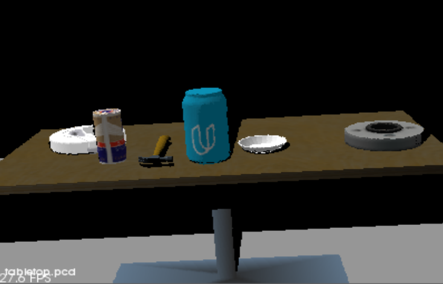

The image often has distortion due to noise and lead to complications in estimation. So, we apply statistical outlier filter to filter unwanted noise. (see diagram below taking from the course note, illustrating the effect on applying the filter)

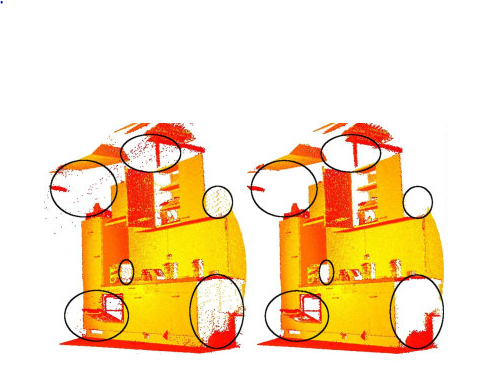

The original table top image is captured by RGB-D camera, which provide feature rich and particularly dense point clouds. So, we apply a vox downsampler filter to derive a point cloud that has fewer points but should still do a good job of representing the input point cloud as a whole. A leaf size of 0.01
seems to be a good value for the image

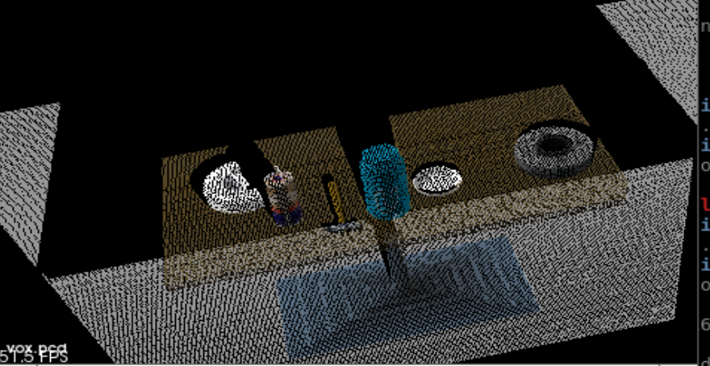

Then we apply a passthrough filter to separate the objects on the table and the table itself as shown below. The region of interest is set to limit the z axis to be between 0.61 and 1.1.

After we apply the passthrough filter, we use the RANSAC algorithm, to identify points in the dataset that belong to the plane (which represent the table). we can find both the inlier and outlier for the plane model. The result is as shown below.

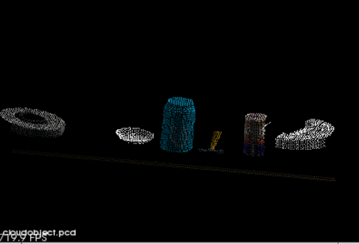

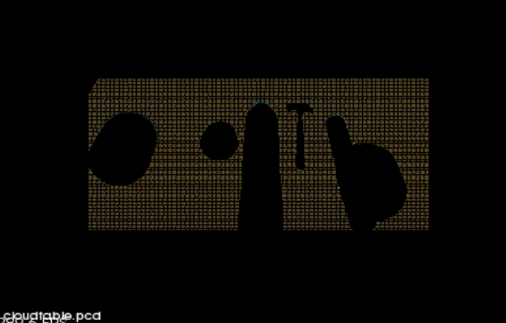

#### 2. Complete Exercise 2 steps: Pipeline including clustering for segmentation implemented.  

The next step is to segment the points into individual objects by using euclidean clustering.

And the cluster identified for the following figure is as shown below

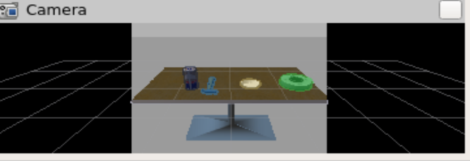

objects identified using clustering

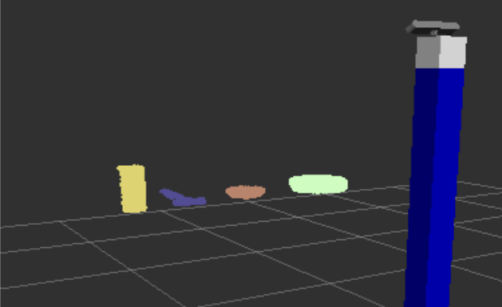

#### 2. Complete Exercise 3 Steps.  Features extracted and SVM trained.  Object recognition implemented.
Here is an example of how to include an image in your writeup.

In This exercise, we are going to train a SVM model to identify the object. Instead of using RGB, we use HSV when we generate the features and this seems to improve the accuracy of prediction.

The accuracy is around 78% using HSV, and 128 bins when i generate the features. And i use 30 iterations when we generate the sample. The corresponding confusion matrix is as shown below

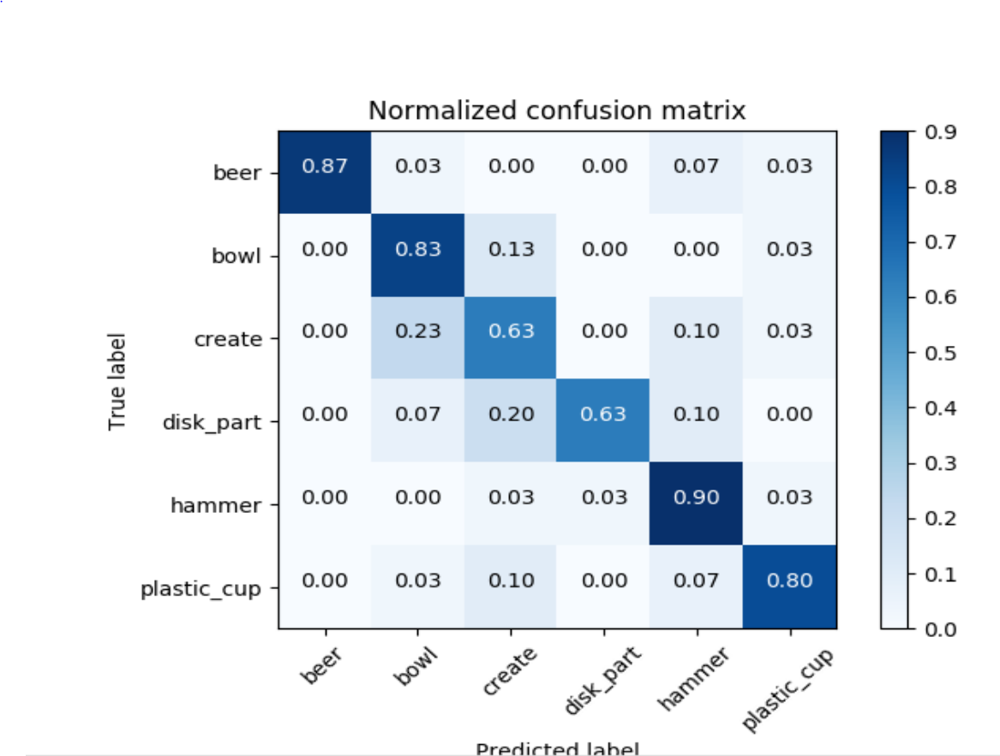

and an example of the objects it recognize in the image is as follows

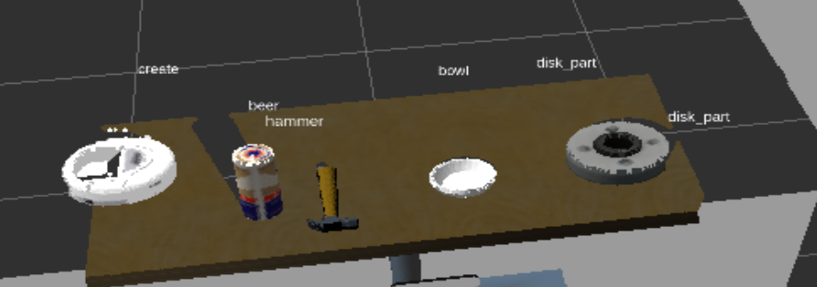

### Pick and Place Setup

Having go through exercise 1-3, the task now is to have pr2 robot to identify the objects, then pick and place the object recognised to the proper box according to the group the object that has been preassigned.

The model was trained by specifying using svm kernal = linear, hsv, 128 bins, and 180 samples per model. The resulting precision and confusion matrix is as follows

scores: [ 0.97569444 0.96180556 0.96875 0.93728223 0.95470383]

AccuracyL 0.96 (+/- 0.03)

Accuracy score: 0.9596662306

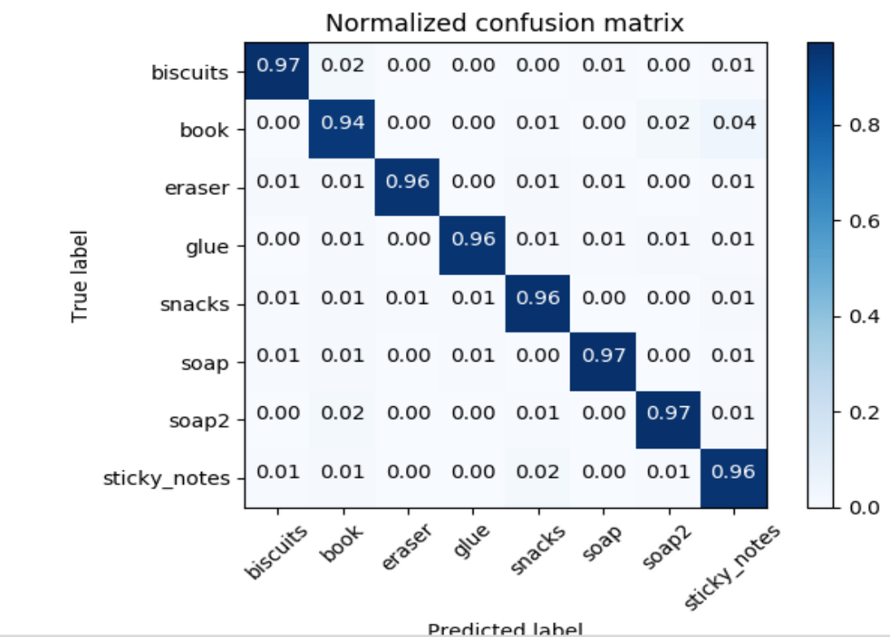
#### 1. For all three tabletop setups (`test*.world`), perform object recognition, then read in respective pick list (`pick_list_*.yaml`). Next construct the messages that would comprise a valid `PickPlace` request output them to `.yaml` format.

### for test scenario 1 ###

model is able to detect the following
  - biscuit
  - soap
  - soap2

matching the actual list of objects

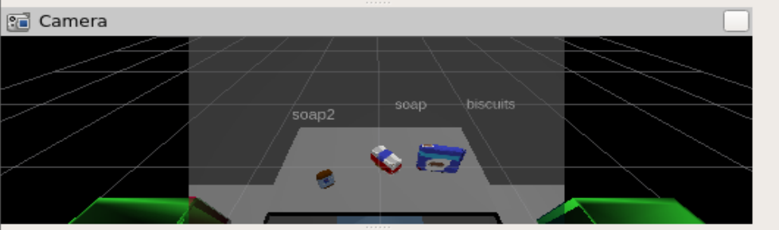

### for test scenario 2 ###

model is able to detect the following
- biscuits
- book
- soap
- soap2
- glue

matching the actual list of objects

### for test scenario 3 ###

model is able to detect the following
- snacks
- biscuits
- book
- soap
- eraser
- soap2
- sticky_notes
- snack (*, it should be glue instead)

it is not able to detect glue in this case.

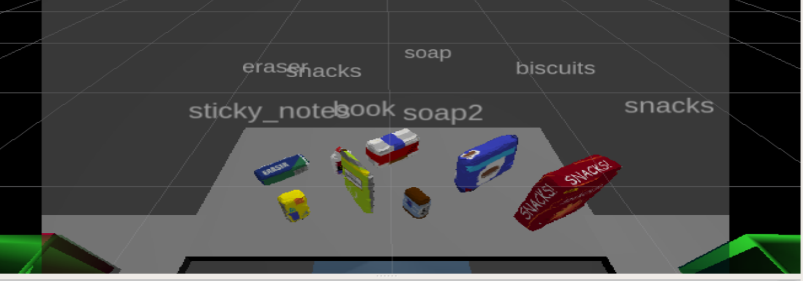

#### 2. Spend some time at the end to discuss your code, what techniques you used, what worked and why, where the implementation might fail and how you might improve it if you were going to pursue this project further. ####

- when kernel is linear, the model seems to perform better than rbf
- Using hsv seems to improve the accuracy significantly, as compared to using RGB
- Increasing the number of random samples per image improve the accuracy. Using 30 random samples per model has around 78% accuracy, increasing it to 180, the accuracy jump to 96%.
- with higher number of bins, the model seems to be better, so i keep it as 128 bins.
- sometimes the object might be obscured by another object in front of it. In this case, the , probably need more random samples to train the model.

